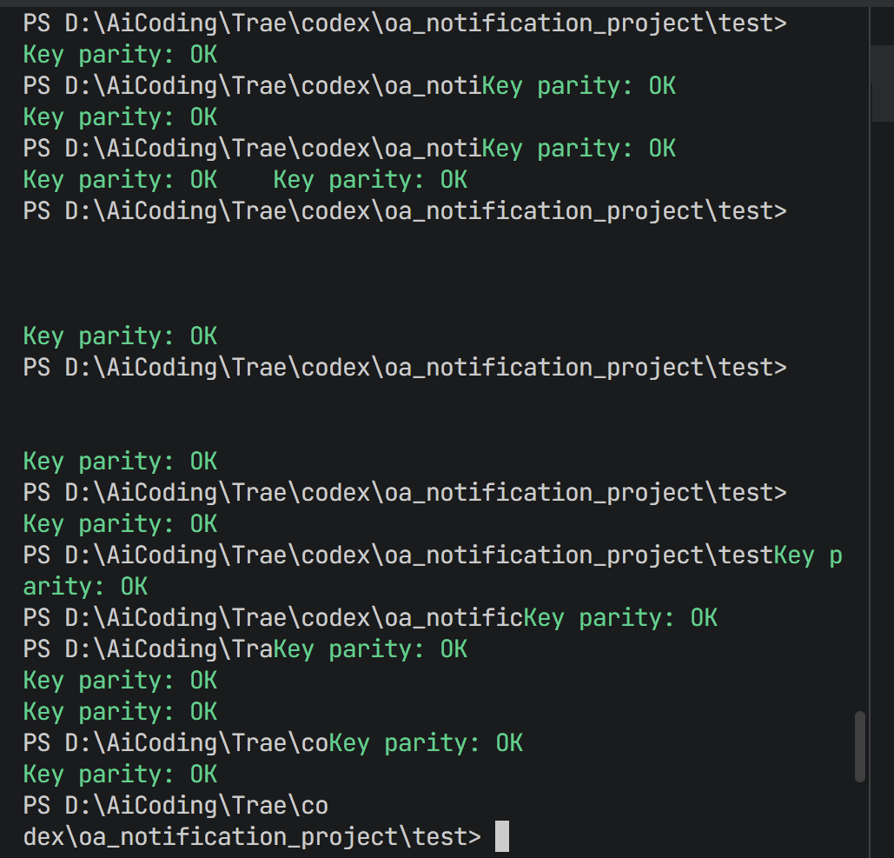

更新时间：2026-04-06

## 一、项目总体状态

当前项目已经完成从“单次爬虫脚本”向“可运行后端原型系统”的升级，已经打通的主链路为：

`OA 通知抓取 -> MySQL 入库 -> 定时执行 -> 邮件提醒 -> 后端 API -> 小程序列表与详情展示`

目前已经完成的重点包括：

- OA 通知抓取
- 通知详情解析
- 附件元数据解析
- MySQL 入库与去重更新
- 定时任务与抓取日志
- 邮件提醒
- 后端 API
- 小程序首页与详情页
- 小程序本地已读状态

---

## 二、已实现功能

### 1. OA 抓取

已实现：

- 访问 OA 首页初始化会话
- 抓取多个栏目列表页
- 分页抓取通知数据
- 解析详情页标题、发布时间、发布单位、正文 HTML、正文纯文本
- 解析附件元数据：
  - `file_id`
  - `filename`
  - `extension`
  - `size`
- 抓取过程增加随机延时
- 支持中断后保存当前已抓取结果

### 2. 数据库存储

已实现：

- 自动创建数据库与表结构
- `notifications` 表去重入库
- `attachments` 表去重入库
- `crawl_job_log` 抓取日志记录
- 多用户订阅与投递基础表：
  - `users`
  - `subscriptions`
  - `notification_delivery_log`

当前附件表设计已经收敛为“仅保留元数据”：

- 不保存附件下载地址
- 不保存附件预览地址
- 不保存附件版本标识
- 仅保留前端展示所需字段

### 3. 定时抓取

已实现：

- 定时调度开关
- 分钟级间隔执行
- 限定轮数测试
- 每轮抓取写入数据库日志

已验证：

- 单轮抓取验证成功
- 2 分钟间隔 3 轮执行成功
- 任务状态和错误信息可落库

### 4. 邮件提醒

已实现：

- SMTP 配置接入
- 基于新增通知发送邮件
- 基于订阅规则创建投递记录
- 邮件发送成功/失败回写

当前状态：

- 邮件提醒已可用
- 小程序提醒仍处于应用内提醒阶段

### 5. 后端 API

已实现接口：

**小程序订阅消息联调接口**

- 日期：2026-04-06
- 内容：

  - `GET /api/miniapp/subscribe/status`：查询绑定/配置状态（已完成）
  - `POST /api/miniapp/session`：code 换 openid 并绑定用户（已完成）
  - `POST /api/miniapp/send-test`：发送订阅消息测试（进行中）
    - 目前微信客户端顺利收到消息通知
- 存在问题：

  - 小程序真机预览无法获取本地后端数据
  - 客户端无法拉起小程序（指真机预览时无法访问本地后端服务）
- 接口当前可提供：

  - 通知列表
  - 通知详情
  - 正文 HTML
  - 小程序专用正文 HTML
  - 正文图片
  - 附件名称、格式、大小

### 6. 小程序前端

1. **首页展示真实通知列表**
2. **点击通知进入详情**

   1. 详情页展示、标题、发布单位、发布时间、分类、正文内容、正文图片、附件名称、分享按钮、收藏按钮、复制原文链接按钮
   2. 附件当前交互设计：

   - 只展示附件名称
   - 点击附件时复制通知原文链接
   - 提示用户到 OA 原页面下载附件
3. **小程序已读状态**

   1. 首页通知支持“未读 / 已读”显示
   2. 点击通知进入详情后，当前通知自动标记为已读
   3. 返回首页后仍保持已读状
   4. 当前设计明确为：

- 只在小程序本地存储已读状态
- 不写入后端数据库
- 不支持跨设备同步
- 不与用户体系、提醒体系联动
- 不参与全局投递统计

---

## 三、已解决的问题

### 1. MySQL 连接失败

现象：

- 程序报错 `Access denied`

原因：

- 配置中数据库密码未正确生效

解决：

- 修正数据库配置并增加连接测试

结果：

- 数据库连接恢复正常

### 2. 定时任务只执行一轮

现象：

- 设置了调度参数但只执行一次

原因：

- 没有真正开启调度器总开关

解决：

- 明确调度开关与间隔配置

结果：

- 成功完成多轮定时测试

### 3. 网络请求间歇性失败

现象：

- 出现 `SSLEOFError`、`RemoteDisconnected` 等异常

原因：

- WAF、环境和本机安全软件共同影响

解决：

- 分层验证网络能力
- 调整环境白名单
- 加入随机延时

结果：

- 抓取链路恢复可用

### 4. 附件下载规则不稳定

现象：

- 早期尝试拼接附件下载地址，但浏览器和前端行为不稳定

原因：

- OA 附件下载依赖上下文和会话

解决：

- 放弃在当前阶段提供直接下载
- 附件只保留元数据
- 点击附件只复制原文链接，引导到 OA 页面下载

结果：

- 附件链路更稳，符合当前演示需求

### 5. 正文排版在小程序中严重变形

现象：

- 正文被挤成窄列
- 图片与文字排版混乱

原因：

- OA 原始 HTML 中包含大量旧式表格布局和内联样式

解决：

- 提取正文真实内容区域
- 清理旧布局标签
- 输出小程序专用正文 HTML

结果：

- 正文可以按更适合小程序阅读的形式展示

### 6. 小程序首页已读状态缺失

现象：

- 首页只能展示通知列表，无法区分用户是否已阅读

解决：

- 在小程序本地存储中保存已读 `newsId`
- 进入详情页时自动标记为已读
- 返回首页时重新应用已读状态

结果：

- 已读功能已在当前设备上稳定可用

---

## 四、当前待实现功能

### 1. 抓取与同步

- 更完整的增量抓取验证
- 失败重试机制
- 更完善的长期运行策略

### 2. 提醒与订阅

- 小程序服务端提醒链路完全落地
- 小程序消息中心与用户体系联动
- 邮件失败自动重试
- 更细粒度订阅规则：
  - 按栏目
  - 按关键词
  - 按组合条件

### 3. API 与前端

- 搜索接口
- 订阅管理接口
- 收藏持久化
- 用户页面
- 订阅设置页

### 4. 工程化

- 配置整理
- 文档统一编码
- 服务部署方案
- 常驻运行与守护机制

---

## 五、当前可用于演示的内容

目前已经可以演示：

1. 抓取 OA 最新通知并入库
2. 查看抓取日志和任务状态
3. 发送邮件提醒
4. 查看小程序首页真实通知列表
5. 查看通知详情正文和图片
6. 查看附件名称并复制原文链接
7. 在小程序中验证本地已读状态

---

## 六、下一步建议

建议后续按以下顺序推进：

1. 固化当前小程序已读与详情链路
2. 完成小程序应用内提醒中心
3. 完成订阅管理和搜索接口
4. 推进小程序提醒与邮件提醒统一建模
5. 再考虑真实微信订阅消息接入

## 2026-04-06 新增进度补充

### 1. 已完成

- 已补充“用户-发布单位（publish_department）”订阅关系接口，支持一个用户订阅多个部门。
- 已新增后端接口：
  - GET /api/subscriptions/departments
  - POST /api/subscriptions/department
- 已在小程序通知详情页的“发布单位”后增加加号入口。
- 当前用户未订阅该发布单位时，点击加号后会弹出确认框：
  - 是：订阅该部门，并尝试申请小程序订阅消息权限；若用户同意模板授权，则该部门订阅关系的 enable_wechat=1。
  - 否：仍订阅该部门，但不增加小程序通知渠道；该部门订阅关系的 enable_wechat=0。
- 上述操作不会修改原有邮箱通知配置；邮箱通知字段不受该按钮影响。

### 2. 当前实现边界

- 当前“部门订阅加号”入口已接入通知详情页。
- 当前“是否已订阅该发布单位”的前端判断，基于后端返回的用户部门订阅列表。
- 当前订阅对象明确为 notifications.publish_department。

### 3. 未完成功能 / TODO

- 个人中心-设置-订阅管理页尚未开发。
- 尚未提供“已订阅部门列表”的独立管理界面。
- 尚未提供取消订阅、批量订阅、订阅渠道单独编辑等交互。
- 首页通知列表中的“发布单位”后方尚未统一增加订阅加号入口；当前仅在通知详情页接入。
- 需要后续补充“个人中心-设置”中对用户-部门订阅关系的查询、增删改管理能力。

## 2026-04-07 新增进度补充

### 1. 已完成

- 已补充“用户-发布单位（publish_department）”订阅关系接口，支持一个用户订阅多个部门。
- 已新增后端接口：
  - `GET /api/subscriptions/departments`
  - `POST /api/subscriptions/department`
- 已在小程序通知详情页的“发布单位”后增加加号入口。
- 当前用户未订阅该发布单位时，点击加号后会弹出确认框：
  - 是：订阅该部门，并尝试申请小程序订阅消息权限；若用户同意模板授权，则该部门订阅关系的 `enable_wechat=1`。
  - 否：仍订阅该部门，但不增加小程序通知渠道；该部门订阅关系的 `enable_wechat=0`。
- 上述操作不会修改原有邮箱通知配置；邮箱通知字段不受该按钮影响。
- 已修正订阅写库逻辑：用户只有点击“订阅发布单位”时，才会写入 `subscriptions` 表。
- 已移除旧的“根据 notifications.publish_department 自动初始化全量部门订阅”的实际生效逻辑。
- 已确认新建订阅记录时默认 `enable_email=1`，表示默认接收邮件通知。

### 2. 当前实现边界

- 当前订阅对象明确为 `notifications.publish_department`。
- 当前“订阅发布单位”入口仅接入通知详情页，首页通知列表尚未统一接入。
- 当前入口只控制 `enable_wechat` 字段，不修改 `enable_email`。
- 当前用户拒绝小程序通知时，系统仍会创建该部门的订阅关系，但仅将 `enable_wechat=0`。
- 当前邮件通知默认开启，不在订阅弹窗中询问用户。
- 当前“个人设置”页面尚未接入，因此邮件通知开关还不能由用户自行关闭。
- 当前与“订阅发布单位”相关的后端职责拆分为三层：
  - `GET /api/subscriptions/departments`：查询当前用户已订阅的发布单位列表，供前端判断是否显示加号。
  - `POST /api/subscriptions/department`：接收前端发起的“订阅发布单位”请求，并执行写库。
  - `upsert_department_subscription(...)`：数据库层核心函数，负责“有则更新、无则插入”订阅关系。

### 3. 未完成功能 / TODO

- 个人中心-设置-订阅管理页尚未开发。
- 尚未提供“已订阅部门列表”的独立管理界面。
- 尚未提供取消订阅、批量订阅、订阅渠道单独编辑等交互。
- 首页通知列表中的“发布单位”后方尚未统一增加订阅加号入口；当前仅在通知详情页接入。
- “个人中心-设置”中关闭邮件接收能力尚未开发；当前邮件接收按默认开启处理。
- 需要后续补充“个人中心-设置”中对用户-部门订阅关系的查询、增删改管理能力。

---

## 2026-04-08 新增进度补充

### 1. 已完成

- 已修复小程序详情页与“我的”页的关键乱码/脚本问题，恢复基础可用状态。
- 已在 `users` 表补充用户提醒刷新周期字段：
  - `notification_refresh_interval_minutes`
  - `last_notification_check_at`
- 已新增后端接口：
  - `GET /api/users/settings`
  - `POST /api/users/settings`
- 已将小程序“我的”页的刷新周期配置接入后端真实接口。
- 已将投递任务从“固定取最旧三条通知”切换为“按到期用户检查并生成投递记录”。
- 已将小程序订阅消息自动发送正式接入主投递流程。
- 当前用户刷新周期支持四档：
  - `1分钟`
  - `5分钟`
  - `半小时`
  - `1小时`
- 用户修改刷新周期后，可立即写入数据库，并将新的检查起点重置为当前时间。
- 用户修改刷新周期后，后端固定执行：
  - 更新 `notification_refresh_interval_minutes`
  - 重置 `last_notification_check_at = 当前时间`

### 2. 当前实现边界

- OA 通知抓取仍然是全局统一调度，不会因为不同用户配置不同周期而按用户重复抓取 OA。
- 用户个性化配置只影响“多久检查该用户是否有应接收的新通知”。
- 当前投递任务会为到期用户同时创建：
  - 邮件投递记录
  - 小程序投递记录
- 当前主投递任务会同时尝试：
  - 自动发送邮件
  - 自动发送小程序订阅消息
- 小程序投递记录会根据实际发送结果更新为：
  - `success`
  - `failed`
  - `pending` 仅表示尚未执行发送
- 邮件提醒开关、小程序提醒开关在“我的”页中仍为前端占位交互，尚未接入独立后端设置。

### 3. 本轮测试入口

- 步骤一：验证详情页恢复
  - 微信开发者工具重新编译小程序
  - 从首页点击任意通知进入详情页
  - 预期：不再卡在“详情加载中”
- 步骤二：验证用户设置接口
  - `GET /api/users/settings?userEmail=3307180168@qq.com`
  - 预期：返回 `refreshIntervalMinutes` 和 `lastNotificationCheckAt`
  - `POST /api/users/settings`
  - 请求体示例：
    - `{"userEmail":"3307180168@qq.com","refreshIntervalMinutes":5}`
  - 预期：数据库中用户刷新周期更新为 5
- 步骤三：验证小程序“我的”页回显与保存
  - 打开小程序“我的”页
  - 修改刷新周期为任一选项
  - 预期：出现保存成功 toast
  - 退出并重新进入“我的”页，预期展示最新选择
- 步骤四：验证按用户周期检查
  - 将某个用户 `last_notification_check_at` 手动改为早于当前时间 60 分钟以上
  - 运行 `oa_delivery_main.py`
  - 预期：终端输出 `checked_users / matched_notifications / created_email_delivery_records`
  - 再次立即运行，若未到周期，则该用户不会再次被检查

### 4. 未完成功能 / TODO

- “我的”页中的邮件提醒开关尚未接入真实后端字段。
- “我的”页中的小程序提醒开关尚未接入真实后端字段。
- 当前尚未提供用户级投递任务的常驻调度器，只完成了按用户周期判断的单次执行逻辑。
- 后续需要将该逻辑接入常驻任务或系统服务中，形成稳定的周期投递服务。
- 个人中心中的订阅管理、取消订阅、渠道编辑仍未完成。

### 5. 本轮补充说明

- 已排查当前用户 `3307180168@qq.com` 的订阅数据。
- 历史上曾存在部分 `subscriptions.enable_email = 0` 的脏数据，与当前“订阅即默认接收邮件通知”的业务规则不一致。
- 已在数据库初始化流程中补充一次性修正规则：
  - 对当前有效的部门订阅记录，若 `enable_email = 0`，则自动修正为 `1`
- 当前库内该用户订阅记录已核对为：
  - 邮件渠道默认开启
  - 小程序渠道按用户授权结果保留 `0 / 1`

### 6. 通知周期场景测试进度

- 已测试通过：
  - 已到通知周期，但没有新的通知，用户不收到提醒
  - 已到通知周期，且有新的通知，用户收到提醒
  - 未到通知周期，且没有新的通知，用户不收到提醒

### 7. 2026-04-08 场景联调记录

- 为覆盖测试场景，已人工插入测试通知：
  - 一条属于已订阅部门
  - 一条属于未订阅部门
- 联调结论如下：
  - 已订阅部门的新通知会命中用户订阅关系，生成邮件投递记录与小程序投递记录
  - 未订阅部门的新通知不会生成该用户的投递记录
  - 首次在沙箱环境中执行邮件发送时，受本机套接字权限限制，邮件发送失败
  - 在提权环境中再次执行后，邮件发送成功，验证通过
- 关键验证点：
  - `TEST_UNSUB_...` 未产生任何投递记录
  - `TEST_SUB2_...` 产生了：
    - 1 条 `email` 投递记录，状态为 `success`
    - 1 条 `miniapp` 投递记录，已进入自动发送链路
  - `TEST_AUTO_MP_...` 产生了：
    - 1 条 `email` 投递记录，状态为 `success`
    - 1 条 `miniapp` 投递记录，状态为 `success`
  - 成功发送后，立即再次执行投递任务：
    - `checked_users = 0`
    - `matched_notifications = 0`
    - 说明未到下一个刷新周期时不会重复检查

## 2026-04-09 新增进度补充

### 1. 已完成

- 已将通知发送判定规则进一步统一为：
  - 用户开启对应提醒渠道
  - 用户订阅的发布单位存在新消息
- 已完成用户级提醒开关真实落库与校验：
  - 关闭小程序提醒后，`users.miniapp_notifications_enabled = 0`
  - 开启小程序提醒后，`users.miniapp_notifications_enabled = 1`
  - 关闭邮箱提醒后，`users.email_notifications_enabled = 0`
  - 开启邮箱提醒后，`users.email_notifications_enabled = 1`
- 已完成“收藏和订阅”页订阅管理逻辑收敛：
  - 页面只负责“订阅 / 取消订阅发布单位”
  - 不再提供部门级邮件渠道、小程序渠道单独编辑
- 已完成后端批量订阅保存接口收敛：
  - `POST /api/subscriptions/batch` 当前只接收部门订阅状态
  - 不再保存部门级 `enableEmail` / `enableWechat`
- 已完成订阅详情页订阅接口收敛：
  - `POST /api/subscriptions/department` 当前只负责建立用户与发布单位订阅关系
  - 不再接收和回写 `enableWechat`
- 已完成订阅表字段收口：
  - 已从 `subscriptions` 表结构定义中移除 `enable_email`
  - 已从 `subscriptions` 表结构定义中移除 `enable_wechat`
  - 数据库初始化逻辑已补充删除旧字段的迁移处理
- 已完成主投递链路代码收敛：
  - 当前邮件是否发送，只看 `users.email_notifications_enabled`
  - 当前小程序是否发送，只看 `users.miniapp_notifications_enabled`
  - `subscriptions` 当前只承担“是否订阅某个发布单位”的职责
- 已完成人工构造测试通知并验证“命中订阅部门”的投递判断：
  - 已人工插入一条属于用户真实已订阅部门的测试通知
  - 已成功命中投递逻辑，生成 1 条 `email` 投递记录与 1 条 `miniapp` 投递记录
- 已修复投递过程中的一个真实缺陷：
  - 修复 `count_user_new_notifications_since(...)` 参数数量与 SQL 占位符不一致的问题

### 2. 当前实现边界

- 当前通知是否发送，最终只依赖以下四类信息：
  - `users.email_notifications_enabled`
  - `users.miniapp_notifications_enabled`
  - `subscriptions` 中用户与发布单位的订阅关系
  - `notifications` 中是否存在订阅发布单位的新消息
- 当前“是否订阅部门”和“是否开启提醒渠道”已经明确拆层：
  - 订阅关系保存在 `subscriptions`
  - 渠道开关保存在 `users`
- 当前订阅详情页点击订阅发布单位时，仍会尝试发起微信订阅消息授权弹窗；
  - 但该动作不再影响订阅表字段设计
  - 是否真正发送小程序通知，最终仍以 `users.miniapp_notifications_enabled` 为准
- 当前测试中，业务链路已经验证到“命中并生成投递记录”这一步；
  - 但在当前本机环境下，邮件 SMTP 与微信接口访问均受到 `WinError 10013` 限制
  - 因此本轮未完成“真实外发成功”验证，只完成了“应发即入投递并执行发送”验证

### 3. 未完成功能 / TODO

- 需要同步更新 `READ` 目录下与旧字段相关的历史文档描述，移除 `subscriptions.enable_email / enable_wechat` 的旧口径。
- 需要同步更新测试文档中的历史说明，统一改为“用户表控制渠道开关，订阅表只控制订阅关系”。
- 需要继续补测以下场景并形成书面测试结论：
  - 关闭邮箱提醒后，不生成 `email` 投递记录
  - 关闭小程序提醒后，不生成 `miniapp` 投递记录
  - 未订阅部门有新消息时，不生成任何投递记录

---

## 2026-04-10 新增进度补充

### 1. 已完成

- 已完成通知“人群相关性筛选”第一阶段落地，并在现有真实通知数据上完成标签重算。
- 已在 `notifications` 表新增研究生、教职工筛选结果字段：
  - `audience_graduate`
  - `audience_graduate_rule_version`
  - `audience_graduate_rule_detail`
  - `audience_staff`
  - `audience_staff_rule_version`
  - `audience_staff_rule_detail`
- 已将原本仅支持“本科生”的判定链路抽象为通用人群判定链路，当前支持三类人群：
  - 本科生
  - 研究生
  - 教职工
- 已完成判定链路落地：
  - 爬虫抓取通知后，提取 `title`、`category`、`content_text`、`publish_department`
  - 入库前按人群规则表进行关键词匹配和发布单位匹配
  - 按命中规则累加权重分数
  - 达到阈值后，将判定结果写入 `notifications` 对应人群字段
  - 后续查询接口直接按已落库标签筛选，不在接口层重复现算
- 已新增人群通知查询接口：
  - `GET /api/notifications/undergraduate`
  - `GET /api/notifications/graduate`
  - `GET /api/notifications/staff`
- 已在现有库内通知数据上执行重算，不重新爬虫，直接基于已有真实数据完成筛选验证。
- 当前真实数据筛选结果如下：
  - 本科生相关通知：7 条
  - 研究生相关通知：6 条
  - 教职工相关通知：26 条

### 2. 当前实现边界

- 当前人群筛选仍属于“规则匹配型识别”，核心依据为：
  - 标题关键词
  - 分类关键词
  - 正文关键词
  - 发布单位命中
- 当前研究生筛选结果字段含义为：
  - `audience_graduate`：是否判定为研究生相关，`1` 表示命中，`0` 表示未命中
  - `audience_graduate_rule_version`：该条研究生判定使用的规则版本，当前为 `v1`
  - `audience_graduate_rule_detail`：研究生判定明细，记录总分、是否命中、命中的关键词/部门规则
- 当前教职工筛选结果字段含义为：
  - `audience_staff`：是否判定为教职工相关，`1` 表示命中，`0` 表示未命中
  - `audience_staff_rule_version`：该条教职工判定使用的规则版本，当前为 `v1`
  - `audience_staff_rule_detail`：教职工判定明细，记录总分、是否命中、命中的关键词/部门规则
- 当前接口职责已明确：
  - `GET /api/notifications/undergraduate`：返回已被判定为本科生相关的通知列表
  - `GET /api/notifications/graduate`：返回已被判定为研究生相关的通知列表
  - `GET /api/notifications/staff`：返回已被判定为教职工相关的通知列表
- 当前接口查询逻辑均为“查已落库标签”，而不是在接口请求时重新跑规则。
- 当前规则版本均为 `v1`，后续若有规则调整，需要同步升级规则版本并考虑历史数据重算。

### 3. 已知边界和下一步计划

- 当前教务处规则对本科生判定有明显增强作用，但也可能带来误判；后续需要收紧“部门命中即加分”的使用策略。
- 当前教职工结果数量相对较多，说明“教师 / 辅导员 / 部门”组合规则仍需进一步压缩误判范围。
- 当前人群规则已入库，但尚未提供后台管理界面；后续需要支持：
  - 规则新增
  - 规则停用
  - 权重调整
  - 规则版本管理
- 当前已具备全量通知重算能力，但尚未形成正式后台入口；后续应补充：
  - 指定范围重算
  - 全量重算
  - 重算任务日志
- 当前尚未建立人工校验闭环；后续应补充：
  - 抽样核验机制
  - 误判样本登记
  - 漏判样本登记
  - 规则调优记录
- 下一步建议顺序如下：
  - 优化本科生“教务处命中即加分”规则
  - 优化教职工规则，降低误判量
  - 将三类人群字段与筛选逻辑补入数据库设计文档
  - 视前端需求决定是否新增“本科生 / 研究生 / 教职工”专区入口

---

## 2026-04-13 代码与文档一致性核对补充

### 1. 已完成

- 已完成对当前代码与文档的一轮交叉核对，确认以下功能已实际落地，不应再继续标注为“未完成”：
  - 小程序“我的”页邮件提醒开关已接入真实后端字段 `users.email_notifications_enabled`
  - 小程序“我的”页小程序提醒开关已接入真实后端字段 `users.miniapp_notifications_enabled`
  - 小程序“我的”页刷新周期配置已接入真实后端接口 `GET /api/users/settings`、`POST /api/users/settings`
  - 小程序“收藏和订阅”页已提供订阅管理页签，并已接入 `POST /api/subscriptions/batch`
  - 首页已新增“适用人群”下拉筛选，支持：
    - 全部人群
    - 本科生
    - 研究生
    - 教职工
  - 首页人群下拉已接入以下接口：
    - `GET /api/notifications`
    - `GET /api/notifications/undergraduate`
    - `GET /api/notifications/graduate`
    - `GET /api/notifications/staff`
- 已确认当前通知筛选链路支持“多标签并存”：
  - 同一条通知可以同时命中本科生和研究生
  - 前端在筛选本科生或研究生时，均可展示该条通知

### 2. 当前实现边界

- 当前“我的”页已实现用户级提醒设置读写，但仍属于基础版设置页：
  - 已支持邮箱提醒开关
  - 已支持小程序提醒开关
  - 已支持刷新周期配置
  - 尚未支持手机号、邮箱、密码修改
- 当前“收藏和订阅”页中：
  - “订阅管理”已可对发布单位进行批量勾选并保存
  - 但当前取消订阅尚未增加二次确认提示
  - 当前订阅管理仍是基础版，不含更细粒度的运营说明和管理能力
- 当前“搜索页”仍为前端本地搜索实现：
  - 数据源来自 `/api/notifications?limit=100`
  - 仅支持本地关键词匹配标题、发布单位、摘要
  - 尚未支持“全部通知 / 仅订阅通知”搜索范围切换
  - 尚未支持清除搜索历史
  - 尚未接入后端搜索接口
- 当前“收藏功能”仍为本地存储实现：
  - 仅保存在小程序本地
  - 不支持跨设备同步
  - 未接入后端持久化
  - 未实现收藏上限 `20` 条校验
- 当前首页虽然已支持人群下拉筛选，但搜索页、收藏页尚未同步接入人群筛选逻辑。

### 3. 明确未完成功能

- 用户角色与权限：
  - 尚未建立正式的用户身份字段与权限模型
  - 尚未实现按身份默认展示对应人群通知
  - 尚未实现管理员侧人群标签人工修正
- 订阅管理：
  - 尚未补“取消订阅二次确认”
  - 尚未补独立的已订阅部门列表管理体验优化
  - 尚未补首页列表中的统一订阅入口
- 搜索：
  - 尚未实现后端搜索接口
  - 尚未实现搜索范围切换
  - 尚未实现清空搜索历史
  - 尚未实现高级搜索
- 收藏：
  - 尚未实现后端收藏表与持久化接口
  - 尚未实现收藏上限控制
  - 尚未实现跨设备同步
- 用户个人信息：
  - 尚未实现修改手机号
  - 尚未实现修改邮箱
  - 尚未实现验证码发送与校验
  - 尚未实现修改密码
- 消息提醒与运维：
  - 尚未实现发送失败后的管理员告警机制
  - 尚未实现失败重试策略
  - 尚未实现投递服务常驻化
- 人群筛选：
  - 尚未实现规则后台管理界面
  - 尚未实现人工校验闭环
  - 尚未实现正式的重算任务入口

### 4. 接下来建议优先级

- 第一优先级：
  - 完成搜索功能正式版
  - 完成收藏后端持久化
- 第二优先级：
  - 完成订阅管理体验补齐
  - 为取消订阅补二次确认
  - 统一首页 / 详情 / 收藏页的订阅入口
- 第三优先级：
  - 完成用户个人信息管理
  - 补手机号 / 邮箱 / 密码修改链路
- 第四优先级：
  - 完成消息失败告警、失败重试、投递常驻化
- 第五优先级：
  - 完成人群规则后台管理、人工校验、重算入口

---

## 2026-04-13 管理员爬虫能力补充

### 1. 已完成

- 已新增管理员爬虫配置持久化表：`crawler_runtime_config`。
- 已将以下全局爬虫参数改为可通过后端接口读取和保存，而不是只写死在 `config.py`：
  - `SCHEDULER_ENABLED`
  - `SCHEDULER_INTERVAL_MINUTES`
  - `SCHEDULER_MAX_RUNS`
  - `MAX_RECORDS`
  - `REQUEST_DELAY_MIN`
  - `REQUEST_DELAY_MAX`
- 已新增管理员接口：
  - `GET /api/admin/crawler/config`
  - `POST /api/admin/crawler/config`
  - `POST /api/admin/crawler/run`
  - `GET /api/admin/crawler/jobs`
  - `GET /api/admin/crawler/job-detail`
- 已补充 `crawl_job_log` 查询能力，管理员现在可以直接查看最近爬虫任务记录。
- 已将 `oa_crawler_main.py` 接入运行时配置加载，手动抓取时会优先使用数据库中的最新爬虫配置。
- 已在小程序“我的”页增加管理员入口，并新增最小版管理员前端页面：
  - 可查看全局爬虫配置
  - 可保存配置
  - 可手动触发一次抓取
  - 可查看最近任务日志

### 2. 当前实现边界

- 当前管理员前端仍放在小程序内，属于开发期最小可用版本，不是独立后台系统。
- 当前管理员接口未接正式管理员鉴权，默认用于本地开发联调。
- 当前 `POST /api/admin/crawler/run` 为后台线程触发单次抓取，不是完整的任务编排中心。
- 当前任务日志页展示的是最近抓取任务记录，不包含完整系统运行日志、投递日志和巡检日志。
- 当前配置修改后，对后续抓取立即生效；如果已有外部常驻调度进程在运行，仍需后续补“热更新/重载”机制说明。

### 3. 未完成功能 / TODO

- 需要补管理员登录、会话校验和角色权限控制。
- 需要补独立的管理员后台，而不是长期放在小程序端承载管理功能。
- 需要补爬虫暂停、恢复、任务取消、指定片段抓取等更细粒度操作。
- 需要补任务详情页、日志筛选、失败重试、管理员告警。
- 需要补投递任务的后台管理页，与爬虫任务管理统一到同一套管理员工作台。

---

## 2026-04-13 通知发送链路统一补充

### 1. 已完成

- 已统一邮箱和小程序的发送链路，不再保留“邮件在抓取阶段直接发送、小程序只写待投递记录”的分裂逻辑。
- 已将抓取主流程调整为：
  - 先抓取 OA 通知并入库
  - 再统一执行投递任务
  - 由投递任务按用户周期、订阅关系、用户提醒开关同时处理邮箱和小程序发送
- 已从抓取脚本中移除旧逻辑：
  - 不再直接调用全局邮箱发送
  - 不再单独只给小程序创建投递记录
- 已新增可复用的投递执行函数 `run_delivery_job(...)`，供：
  - `oa_delivery_main.py` 单独运行
  - `oa_crawler_main.py` 在抓取完成后串行调用
- 当前管理员页点击“立即抓取”后，后台会自动继续执行统一投递流程，不需要再手动补跑一次投递脚本。

### 2. 当前实现边界

- 当前统一后的规则是：只有满足“用户到期 + 已订阅部门有新消息 + 开启对应渠道”时，邮箱和小程序才会在同一轮投递里一起发送。
- 若用户只开启邮箱提醒，则该轮只发邮箱；若只开启小程序提醒，则该轮只发小程序；若两者都开启，则两者都发。
- 当前抓取任务日志和投递任务日志仍然是两条记录：
  - 一条 `manual/scheduled`
  - 一条 `delivery_only`
- 这样做是为了保留链路可审计性，但发送规则已经统一，不再分裂。

### 3. 未完成功能 / TODO

- 需要在管理员前端继续补“投递任务日志”单独查看入口，便于区分抓取成功与发送成功。
- 需要补“立即执行投递”独立按钮，便于只重发 `pending/failed` 记录而不重复抓取。
- 需要补投递失败重试与管理员告警机制。

---

## 2026-04-13 管理员爬虫配置说明补充

### 1. 已补充说明

- 已补充管理员爬虫配置字段说明：
  - `SCHEDULER_ENABLED`
  - `SCHEDULER_INTERVAL_MINUTES`
  - `SCHEDULER_MAX_RUNS`
  - `MAX_RECORDS`
  - `REQUEST_DELAY_MIN`
  - `REQUEST_DELAY_MAX`
- 已补充管理员接口使用场景说明：
  - `GET /api/admin/crawler/config`
  - `POST /api/admin/crawler/config`
  - `POST /api/admin/crawler/run`
  - `GET /api/admin/crawler/jobs`
  - `GET /api/admin/crawler/job-detail`
- 已补充“配置为什么是最新值”的解释：
  - `crawler_runtime_config` 是当前配置表，不是历史配置表
  - 每个 `config_key` 只有一条记录
- 已补充“数据库配置如何同步到当前进程”的落地逻辑：
  - 保存到数据库
  - 调用 `apply_crawler_runtime_config()`
  - 将数据库值同步到当前进程内存中的 `config` 模块变量
- 已补充“如何区分管理员手动执行与自动调度”的口径：
  - 以 `crawl_job_log.job_type`
  - 和 `crawl_job_log.trigger_mode`
  - 作为正式判断依据

### 2. 当前口径

- `lastMessage` 只是运行态辅助文案，不建议作为正式枚举判断来源。
- 任务来源判断应统一使用：
  - `manual + single`
  - `scheduled + scheduler`
  - `delivery_only + after_crawl`

---

## 2026-04-13 抓取与通知职责重新解耦补充

### 1. 已完成

- 已将抓取任务与通知任务重新拆回两套独立逻辑。
- 已从 `oa_crawler_main.py` 中移除“抓取完成后自动串行触发投递任务”的逻辑。
- 当前抓取任务重新收口为：
  - 抓取 OA 通知
  - 保存 `notifications`
  - 保存 `attachments`
  - 记录 `crawl_job_log`
- 当前通知任务继续保留为独立入口：
  - `oa_delivery_main.py`
  - 负责按用户周期检查、生成投递记录、执行邮件和小程序发送

### 2. 当前实现口径

- 抓取是一套全局任务逻辑：
  - 配置只影响“多久抓一轮、一轮抓几条、是否自动抓取”
  - 不直接决定是否通知用户
- 通知是一套用户级任务逻辑：
  - 周期由 `users.notification_refresh_interval_minutes` 控制
  - 是否通知、通知什么内容，由用户设置、订阅关系和通知表共同决定
- 因此从当前开始：
  - 运行 `oa_crawler_main.py` 只会产生抓取任务日志
  - 运行 `oa_delivery_main.py` 才会产生 `delivery_only` 投递任务日志

### 3. 当前边界 / TODO

- 目前抓取任务和通知任务已解耦，但通知任务的独立调度入口还未补正式后台控制。
- 后续需要决定：

  - 是为 `oa_delivery_main.py` 单独补调度模式
  - 还是将通知任务接入独立的服务化调度器

  ## 十七、2026-04-14 API 对标测试流程与逻辑

  ### 1. 测试目标

  - 接口契约一致性 ：验证 Java API 的路径、请求参数、响应状态码及 JSON 载荷结构与 Python API 完全一致。
  - 数据格式与内容对齐 ：确保 Java API 响应中各字段的命名（如驼峰与下划线转换）、数据类型（如日期时间格式）及具体值与 Python API 严格对标。
  - 业务逻辑等价性 ：通过对比关键业务接口的响应数据，间接验证 Java 端业务逻辑与 Python 端在功能实现上的等价性。

  ### 2. 测试环境准备

  为执行对标测试，需要同时启动 Python 和 Java 两个后端服务，并确保它们监听不同的端口：

  - Python 服务端 ：
    - 启动命令 ：在项目根目录 d:\AiCoding\Trae\codex\oa_notification_project 下执行 python oa_api_main.py 。
    - 监听端口 ： http://127.0.0.1:8000 。
  - Java 服务端 ：
    - 启动命令 ：在 Java 项目根目录 d:\AiCoding\Trae\codex\oa_notification_project\oa_notification_java 下执行 mvn -s maven_settings.xml spring-boot:run 。
    - 监听端口 ： http://127.0.0.1:8080 。
  - 数据库 ：两个服务共享同一 MySQL 数据库实例，确保数据源一致。

  ### 3. 测试工具

  - java_api_parity_checks.ps1 脚本 ：位于 d:\AiCoding\Trae\codex\oa_notification_project\test\ 目录下，是一个基于 PowerShell 编写的自动化测试脚本。
  - Invoke-RestMethod ：PowerShell 内置命令，用于发起 HTTP 请求并解析 JSON 响应。

  ### 4. 测试流程与逻辑分析

  该脚本的核心逻辑是“同步请求、分层采样、字段比对”，具体流程如下：

  1. 参数传入 ：
     脚本通过命令行参数接收 Python 和 Java 服务的基准 URL ( -PythonBaseUrl , -JavaBaseUrl )，以及用于特定接口测试的用户邮箱 ( -UserEmail ) 和通知 ID ( -NewsId )。
  2. 同步请求与响应获取 ：
     对于脚本中预定义的所有待测试 API 接口（例如 /api/notifications 、 /api/users/settings 等），脚本会：

     - 向 Python 服务端 ( -PythonBaseUrl ) 发送相同的 HTTP GET 请求，获取其 JSON 响应。
     - 向 Java 服务端 ( -JavaBaseUrl ) 发送相同的 HTTP GET 请求，获取其 JSON 响应。
     - 所有 JSON 响应均通过 Invoke-RestMethod 自动转换为 PowerShell 对象，便于后续的属性访问和比对。
  3. 分层采样与结构化比对 ：
     为确保比对的全面性与效率，脚本采用分层比对策略，逐级深入 JSON 响应结构：

     - 顶层结构比对 ( top-level ) ：首先比对 Python 和 Java 响应的最外层字段（通常为 code , data , message ）。
     - 数据载荷比对 ( data ) ：若顶层结构一致，则深入比对 data 字段下的核心业务数据载荷（例如 notifications 接口的 totalCount , unreadCount 等）。
     - 数组项抽样比对 ( first-item ) ：若 data 载荷中包含列表（如通知列表 items ），则抽取列表的 第一个元素 进行深度字段比对，以验证列表项的结构一致性。
  4. 键集比对逻辑 ：
     核心比对逻辑由 Compare-KeySet 函数实现。该函数通过反射机制提取出两个 JSON 对象的全部属性名集合，并进行以下判断：

     - Missing in Java ：若 Python 响应中存在某个字段，而 Java 响应中缺失，则标记为 错误 。这通常是致命问题，会导致前端因找不到预期字段而崩溃。
     - Extra in Java ：若 Java 响应中存在某个字段，而 Python 响应中缺失，则标记为 警告 。这种情况通常被视为“向上兼容”，不会影响前端的正常运行，但可能意味着 Java 端提供了额外的扩展信息。
     - Key parity: OK ：若两个响应的键集完全一致，则标记为通过。
  5. 内容比对（间接验证） ：
     虽然脚本主要比对键集，但由于 Invoke-RestMethod 会将 JSON 值转换为 PowerShell 对象，如果 Java 和 Python 返回的 数据类型或格式不一致 （例如日期时间格式），在后续的业务逻辑处理中，即使键集一致，也会导致前端解析失败。本测试通过对关键业务接口的全面覆盖，间接验证了数据内容的等价性。
  6. 结果输出 ：
     脚本将每个接口的测试结果（ OK , Missing , Extra 或 request failed ）以不同颜色输出到终端，提供清晰直观的反馈。

  ### 5. 测试结果与结论
- 脚本的三个核心动作

  - 同步请求 ：它会先问 Python 接口：“给我前 5 条通知”，然后再问 Java 接口相同的问题。
  - 结构对比 ：它会检查两个接口返回的 JSON 载荷（Payload）里，字段名是不是一模一样。

    - 错误示例 ：Python 返回 news_id ，Java 返回 newsId 。这会导致小程序找不到数据。
  - 内容对比 ：它会检查具体的值是否一致。

    - 错误示例 ：Python 的日期是 2024-04-14 01:00:00 ，Java 的日期是 2024-04-14T01:00:00.000Z 。这会导致小程序显示乱码。
- 它重点检查哪些接口？

  脚本通常会覆盖我们迁移最核心的几个 API：

1. 通知列表 ( /api/notifications ) ：检查分页和列表展示。
2. 通知详情 ( /api/notification-detail ) ：检查正文 HTML 和附件列表。
3. 用户设置 ( /api/users/settings ) ：检查刷新周期等字段。
4. 订阅管理 ( /api/subscriptions/departments ) ：检查部门订阅状态。
5. 测试结果：

- 
